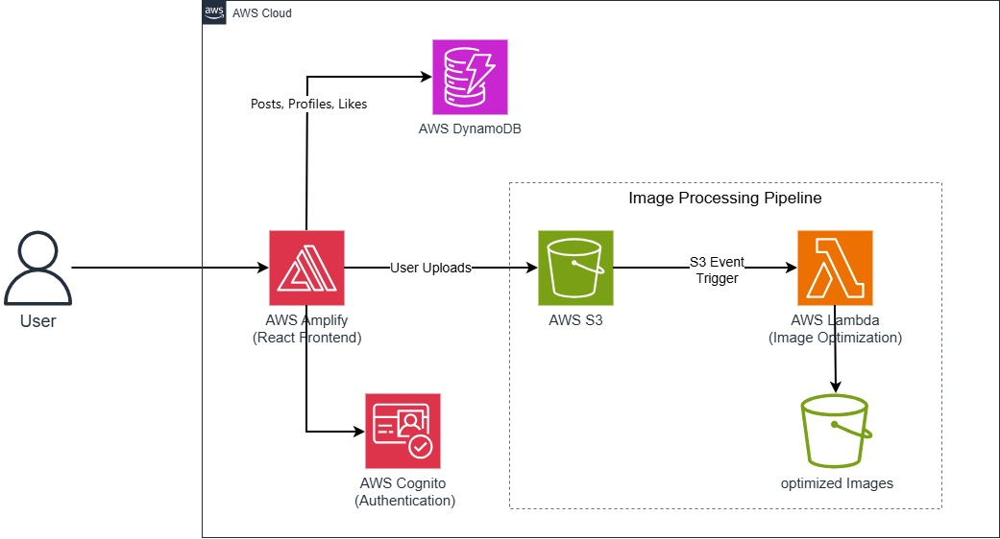
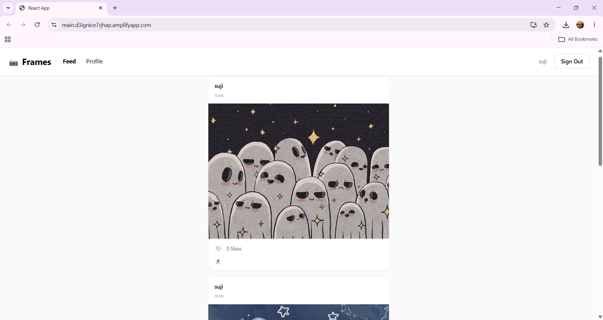
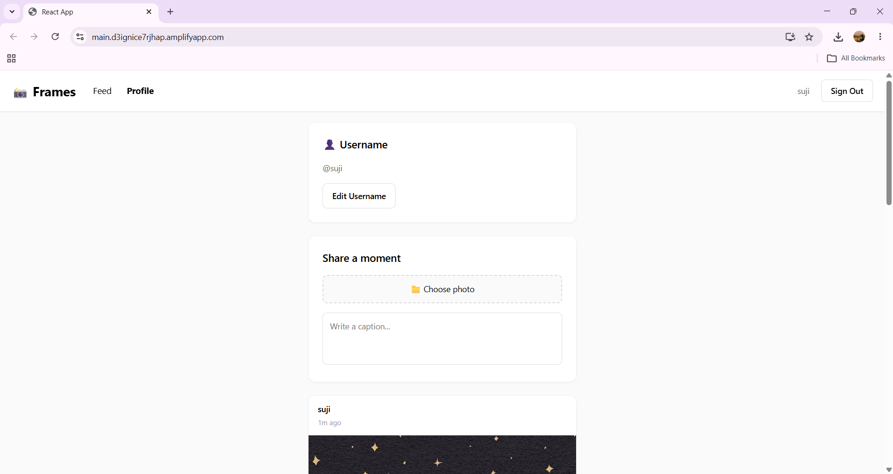
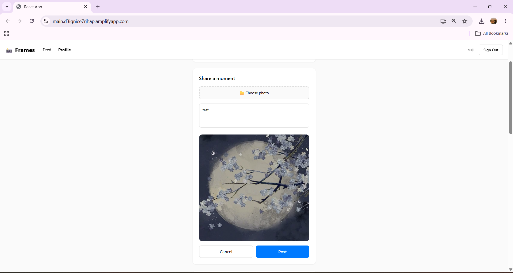
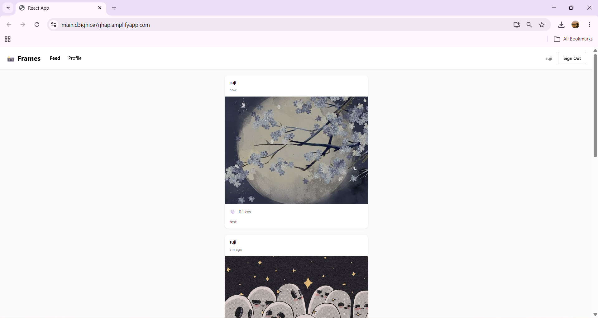
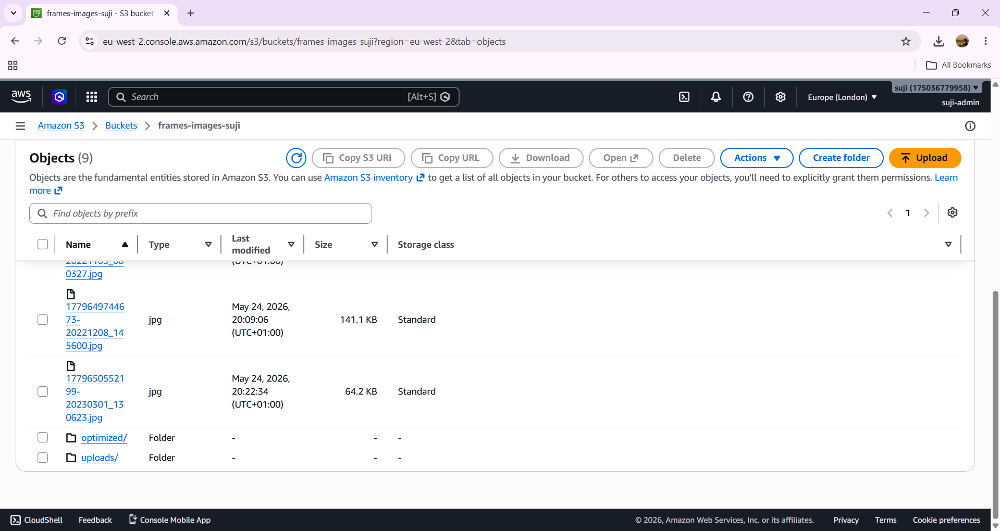
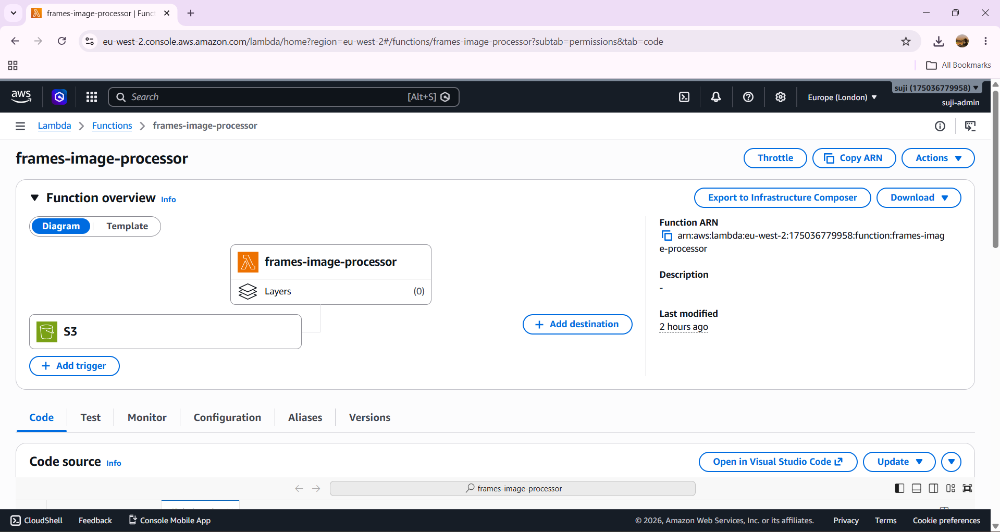
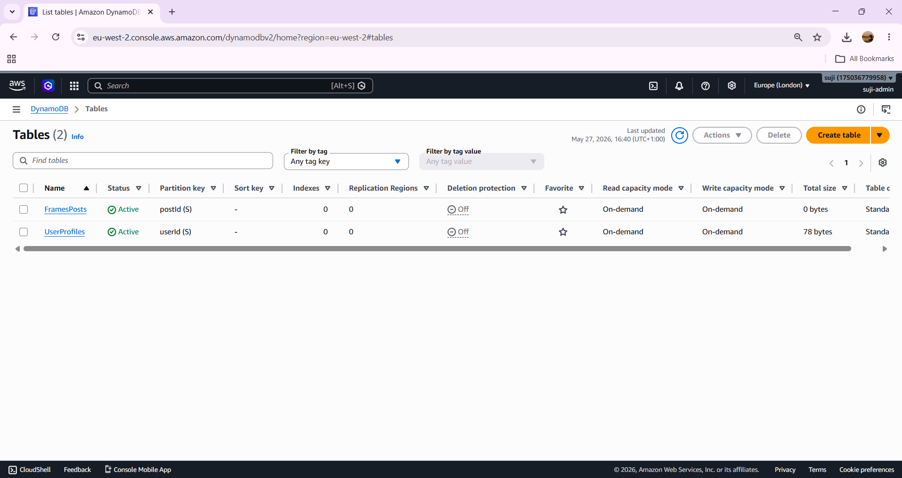
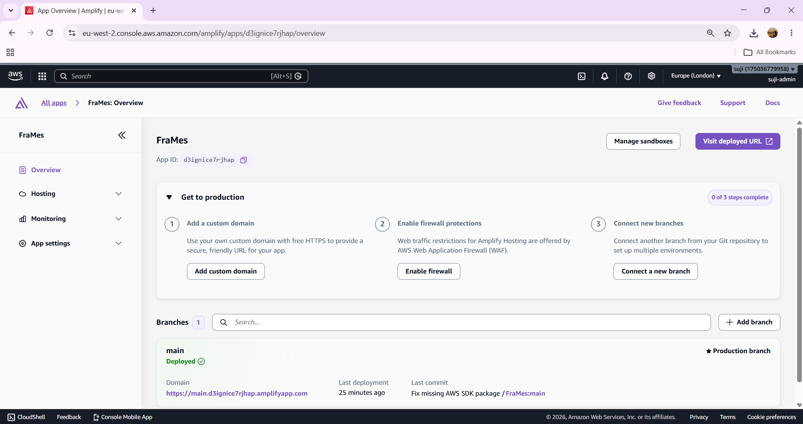

# Frames — Serverless Social Media App

Frames is a cloud-native social media application inspired by Instagram, built using React and AWS serverless services.

The application supports secure authentication, image uploads, multi-user functionality, likes, profile management, and event-driven image processing using AWS Lambda and Amazon S3.

---

# Features

- User authentication with Amazon Cognito
- Multi-user support
- Feed and profile pages
- Image uploads using Amazon S3
- Like system
- Custom usernames
- Delete post functionality
- Event-driven image processing pipeline
- CI/CD deployment using AWS Amplify
- Public cloud deployment

---

# AWS Services Used

- AWS Amplify
- Amazon Cognito
- Amazon S3
- AWS Lambda
- Amazon DynamoDB

---

# Architecture Diagram



---

# Application Screenshots

## Feed Page



---

## Profile Page



---

## Upload Flow



---

## Uploaded Post



---

## S3 Storage



---

## Lambda Image Processing



---

## DynamoDB Tables



---

## Amplify Deployment



---

# Tech Stack

## Frontend
- React.js
- CSS

## Cloud & Backend
- AWS Amplify
- Amazon Cognito
- Amazon S3
- AWS Lambda
- Amazon DynamoDB

---

# Architecture Overview

```text
User
 ↓
React Frontend (AWS Amplify Hosting)
 ↓
Amazon Cognito Authentication
 ↓
Amazon DynamoDB

User Upload
 ↓
Amazon S3
 ↓
S3 Event Trigger
 ↓
AWS Lambda
 ↓
Optimized Images
```

---

# Deployment

The application is deployed using AWS Amplify with GitHub CI/CD integration.

GitHub Repository:
- Connected to AWS Amplify
- Automatic deployments on push to main branch

---

# Technical Concepts Demonstrated

- Serverless Architecture
- Event-Driven Processing
- Cloud Storage Workflows
- NoSQL Data Modeling
- Authentication & Authorization
- CI/CD Deployment
- AWS IAM & Permissions
- Frontend Cloud Integration

---

# Deployment

The application is deployed publicly using AWS Amplify.

- Live Application: https://main.d3ignice7rjhap.amplifyapp.com
- GitHub Repository: https://github.com/sujithaakathirvel/frames-aws

The deployment pipeline is connected to GitHub with automatic CI/CD deployment enabled through AWS Amplify.

---

# Future Improvements

- Follow / Unfollow system
- Comments feature
- Notifications
- Image compression optimization
- Mobile responsiveness improvements
- Infinite scrolling feed

