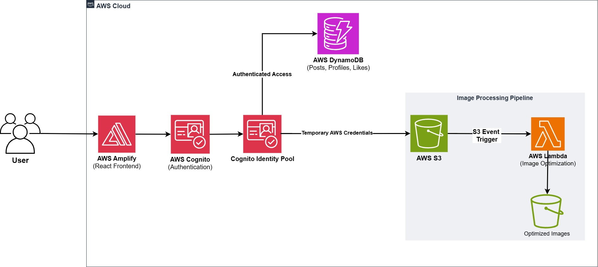
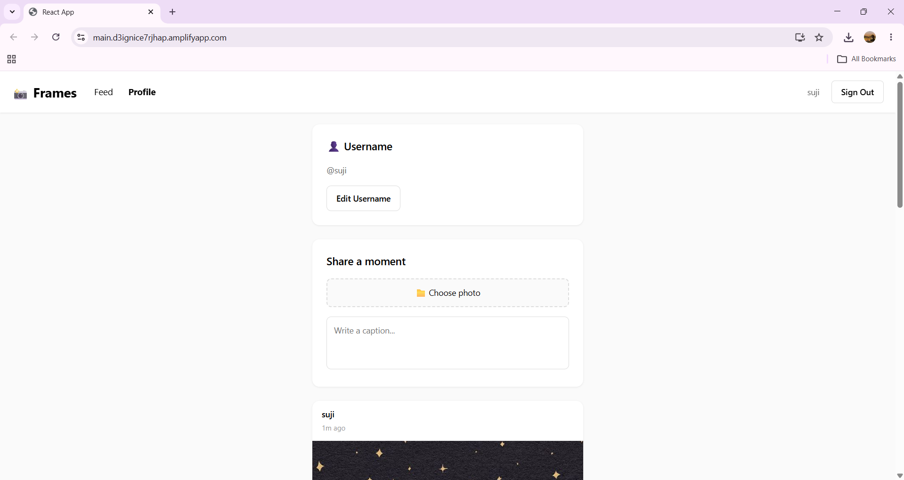
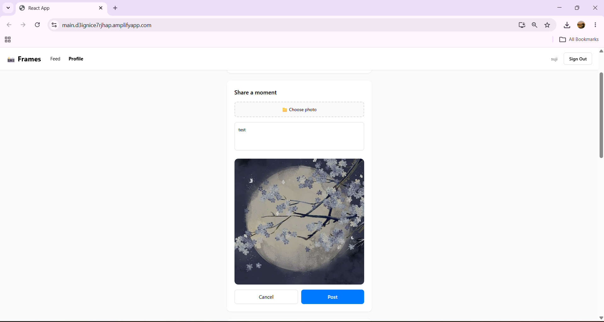
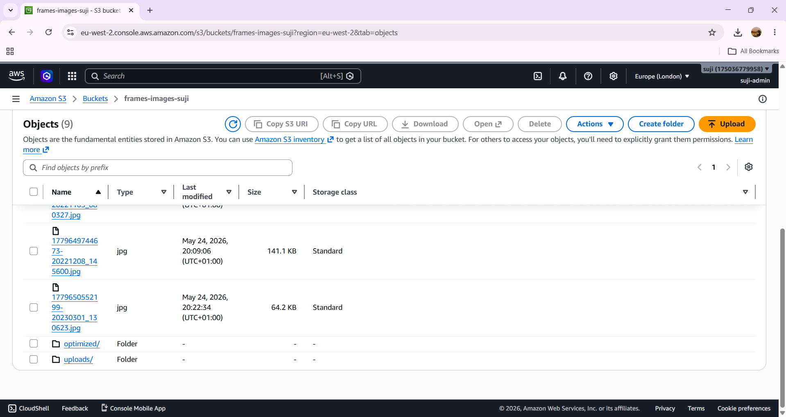
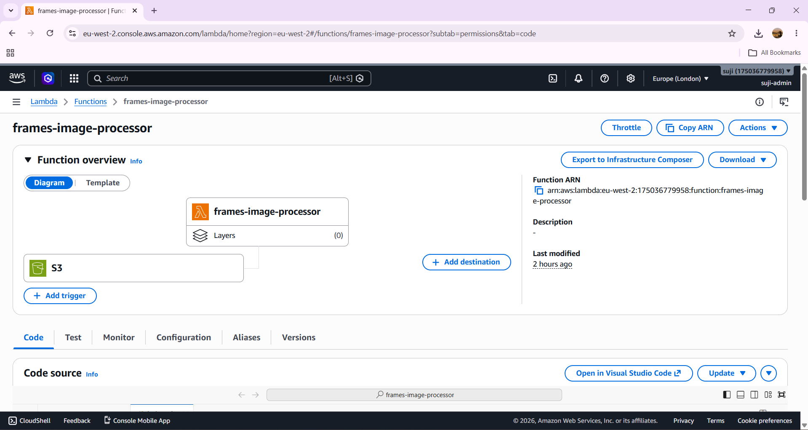
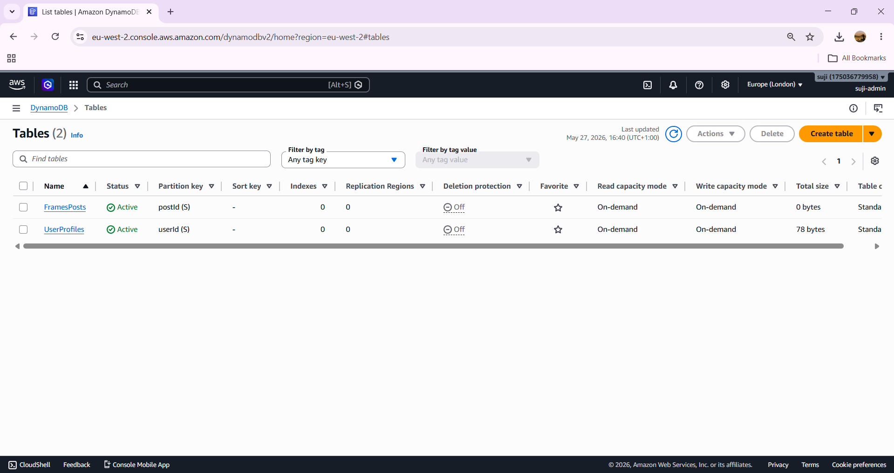
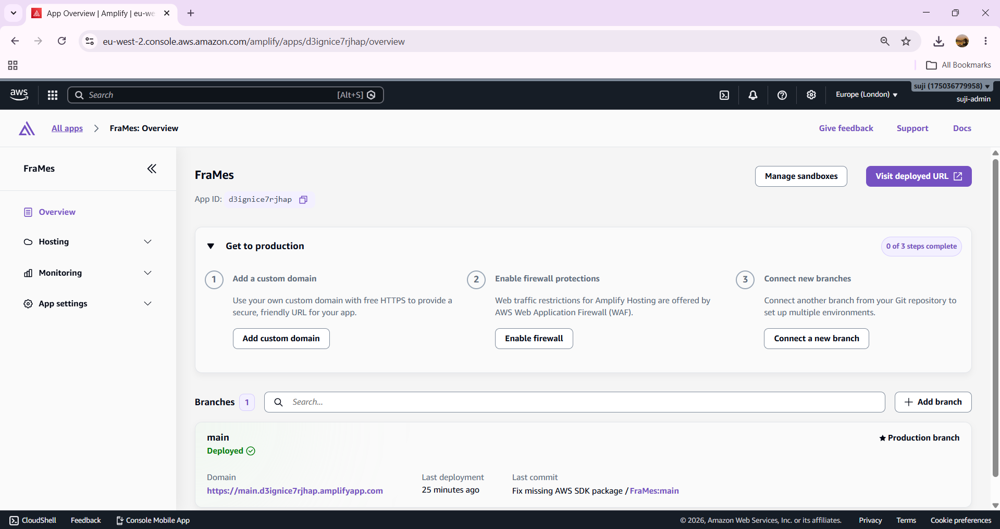

# Frames — Serverless Social Media App

A secure serverless Instagram-style application built on AWS, demonstrating **Cognito authentication, temporary AWS credentials, least-privilege IAM, event-driven processing, and cloud-native deployment**.

🌐 **Live Demo:** https://main.d3ignice7rjhap.amplifyapp.com  
💻 **GitHub:** https://github.com/sujithaakathirvel/frames-aws

---

## ✨ Key Features

- User authentication with Amazon Cognito
- Multi-user feed and profile functionality
- Image uploads using Amazon S3
- Likes and post management
- Custom usernames and profiles
- Event-driven image processing with AWS Lambda
- CI/CD deployment through AWS Amplify

---

## 🏗️ Architecture



Frames uses a serverless architecture combining managed AWS services for authentication, storage, database operations, hosting, and event-driven processing.

---

## 🧠 Engineering Decisions & Challenges

### Replacing Long-Lived AWS Credentials

During development, the frontend initially used AWS access credentials to communicate directly with S3 and DynamoDB.

This was a security risk because long-lived AWS credentials should not be exposed in browser-based applications.

The access model was redesigned using **Amazon Cognito Identity Pools**:

```text
Cognito User Pool
        ↓
Authenticated Identity
        ↓
Temporary AWS Credentials
        ↓
Least-Privilege IAM Role
        ↓
S3 + DynamoDB
```

The IAM role was restricted to the resources and operations required by Frames:

- DynamoDB access limited to `FramesPosts` and `UserProfiles`
- S3 object access limited to the application's upload path
- No long-lived AWS access keys stored in the frontend

The original credential references were removed, and the authentication, upload, posting, liking, and deletion flows were re-tested successfully.

**Key learning:** browser-based AWS applications should use temporary credentials and tightly scoped permissions rather than embedding long-lived credentials in client-side code.

---

## 📊 Performance & Reliability

Performance was measured against the deployed application using end-to-end upload tests.

**Measured flow:** `S3 upload → DynamoDB post creation → feed refresh`

| Image Size | Average | Fastest | Slowest |
|---|---:|---:|---:|
| ~54 KB | 1.43 s | 1.18 s | 1.85 s |
| ~357 KB | 1.06 s | 0.99 s | 1.20 s |
| ~648 KB | 1.00 s | 0.89 s | 1.10 s |

**Overall:** 9 end-to-end upload tests averaged **1.16 seconds**.

### Reliability

A separate sequence of 10 consecutive uploads was performed using a ~54 KB image.

- **10/10 successful**
- **0 failed**
- **100% observed success rate**

### Lambda Observability

During the monitored test window, `frames-image-processor` recorded:

- **3 invocations**
- **0 errors**
- **318 ms average duration**
- **593 ms maximum duration**

> These are observed measurements from the deployed application and test environment, not universal performance guarantees.

---

## 🔐 Security

- Amazon Cognito authentication
- Cognito Identity Pool temporary credentials
- Least-privilege IAM permissions
- S3 access restricted to the application upload path
- DynamoDB access restricted to required tables and operations
- No AWS access keys or secret keys stored in the frontend

---

## ☁️ AWS Services

- **AWS Amplify** — hosting and CI/CD
- **Amazon Cognito** — authentication
- **Cognito Identity Pools** — temporary AWS credentials
- **Amazon S3** — image storage
- **AWS Lambda** — event-driven image processing
- **Amazon DynamoDB** — application data
- **AWS IAM** — authorization and least privilege

---

## 📸 Application

### Feed


### Profile



### Upload



### Uploaded Post


### S3 Storage



### Lambda Image Processing



### DynamoDB



### Amplify Deployment



---

## 🔄 Deployment & CI/CD

The application is deployed through AWS Amplify and connected to GitHub.

- GitHub repository connected to AWS Amplify
- Automatic deployment on push to `main`
- Production frontend hosted through AWS Amplify

---

## 🛠️ Tech Stack

### Frontend
- React.js
- CSS

### Cloud & Backend
- AWS Amplify
- Amazon Cognito
- Cognito Identity Pools
- Amazon S3
- AWS Lambda
- Amazon DynamoDB
- AWS IAM

### Development
- Git
- GitHub
- AWS CLI
- npm

---

## 💡 Technical Concepts Demonstrated

- Serverless architecture
- Event-driven architecture
- Cloud-native application design
- Authentication and authorization
- Least-privilege IAM
- Temporary AWS credentials
- NoSQL data modelling
- Object storage
- CI/CD
- Cloud observability
- Performance testing
- Reliability testing
- Frontend–cloud integration

---

## 🔮 Future Improvements

- Follow / Unfollow system
- Comments and notifications
- Image compression and optimisation
- Infinite scrolling
- Enhanced mobile responsiveness
- Additional automated testing
